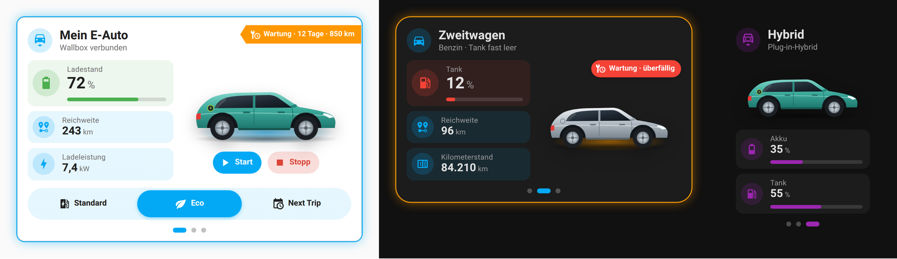

# EV Charge Card

Lovelace card for Home Assistant that shows and controls your **vehicles and wallbox** – electric, hybrid or petrol/diesel:
state of charge or fuel level, range, charging power, vehicle image, start/stop and a freely configurable button bar for the charging mode.
**Multiple vehicles** in one card – switch by swiping or with the dots at the bottom center.

Design and editor follow the same system as [Trash Card Plus](https://github.com/Kohle93/Trash-Card-Plus),
the [Status Summary Card](https://github.com/Kohle93/Status-Summary-Card) and the [Radial Flow Card](https://github.com/Kohle93/radial-flow-card) – all cards are operated the same way and match visually.



<sub>The vehicle in the preview is a custom, generic illustration (not a real model) – see [Image credits](#image-credits).</sub>

## Features

- **Any number of vehicles** in one card: swipe or tap the dots to switch, the height adapts to the vehicle, the last selected vehicle is remembered
- **Drive type per vehicle:** electric, hybrid or petrol/diesel – charging, start/stop and glow adapt automatically
- **Low fuel warning:** for hybrid and petrol/diesel the glow under the car lights up in a warning color as soon as the tank drops below X %
- Optional accent color per vehicle
- **Service flag:** add entities for "days until service" and "km until service" – if the service is due within X days or X km, a flag with an icon appears (shape, position, color, text and size are configurable, red when overdue)
- **Button bar with condition:** only show it when an entity reports a certain state (e.g. wallbox "connected" or "ready")
- Layout: title + values on the left, vehicle image + values on the right, button bar at the bottom (image can also be on the left)
- Very narrow cards automatically stack vertically (threshold configurable)
- **Shared design system:** background *theme / theme + tint / accent color / custom color / transparent* with opacity, gradient and glass effect – for the card and for the value tiles
- Icon background with shape (circle, rounded, square), text color with automatic contrast, border, shadow, corner radius, spacing
- Highlight of the card **while charging or when the tank is almost empty** (glow, pulse, colored border, slightly larger)
- Background image with color overlay
- Any number of values with unit, decimals, factor, progress bar, color thresholds and state translation – every value can override the design
- Button bar with options taken directly from a `select` / `input_select` entity, plus free action buttons (e.g. favorite ☆)
- Start/stop buttons under the car as soon as it is plugged in, and a charging glow under the car
- Tap and hold actions (more-info, toggle, navigate, url, perform-action)
- Bilingual: editor and card texts in German when Home Assistant runs in German, otherwise in English

## Visual editor

Built like Trash Card Plus and the Status Summary Card. Above the tabs you choose the vehicle you are editing (or add a new one) – the tabs General, Vehicle, Values and Buttons apply to that vehicle, Display and Design to the whole card.

| Tab | Content |
|---|---|
| **General** | Drive type, title, title icon, subtitle, own color, actions – below that the list of all vehicles (sort, delete) and buttons to add one (electric / hybrid / petrol-diesel) |
| **Display** | Multiple vehicles (dots, swipe, remember), image/title position, column width, scaling, minimum height, stacking threshold |
| **Vehicle** | Live preview, vehicle image, charging glow, low fuel warning, start/stop (depending on drive type) and service flag |
| **Values** | List of all values (sort, edit, delete), edit page with live preview, color thresholds and state translation with one click, suggestions from your vehicle/wallbox devices |
| **Buttons** | Button bar including the condition "Only show if …", "Take over all options", list of all buttons with edit page |
| **Design** | Accent color, card (background, border, image) and values (background, icon, text, border), highlight – with live preview |

Colors are picked with a color picker. Older configurations (v0.x with `layout:` / `style:` and v1.0 with a single vehicle) are migrated automatically and rewritten to the new `vehicles:` format the next time you save in the editor.

## Installation

### HACS (custom repository)

1. HACS → ⋮ → **Custom repositories**
2. URL `https://github.com/Kohle93/EV-Charge-Card`, type **Dashboard**
3. Install "EV Charge Card", clear your browser cache

### Manual

1. Copy `dist/ev-charge-card.js` to `/config/www/ev-charge-card/ev-charge-card.js`
2. Settings → Dashboards → ⋮ → **Resources** → add:
   - URL: `/local/ev-charge-card/ev-charge-card.js`
   - Type: **JavaScript module**

## Configuration

Full example: [`examples/beispiel.yaml`](examples/beispiel.yaml)

Card settings (display, design) are at the top, everything vehicle-related goes into the `vehicles:` list.

```yaml
type: custom:ev-charge-card
accent_color: [3, 169, 244]
highlight: glow
vehicles:
  - vehicle_type: ev
    title: My EV
    image:
      url: /local/ev/car.png
    fields:
      - entity: sensor.car_battery_level
        name: State of charge
        size: large
        show_bar: true
      - entity: sensor.car_range
        name: Range
    button_bar:
      entity: select.wallbox_charging_mode
    buttons:
      - option: Default
        name: Standard
        icon: mdi:ev-station
      - option: Eco
        icon: mdi:leaf
  - vehicle_type: combustion
    title: Second car
    title_icon: mdi:car
    fuel:
      entity: sensor.second_car_fuel
      threshold: 15
    fields:
      - entity: sensor.second_car_fuel
        name: Fuel
        icon: mdi:gas-station
        show_bar: true
```

Colors accept color picker values `[r, g, b]`, hex codes (`#9ccc3c`) or HA color names (`green`, `amber`, `primary` …).

### `vehicles[]` – vehicles

| Option | Description |
|---|---|
| `vehicle_type` | `ev` (electric, default) / `hybrid` / `combustion` (petrol/diesel) |
| `title`, `title_icon` | Title and icon |
| `subtitle` / `subtitle_entity` | Subtitle (text or the state of an entity) |
| `title_tap_action` / `title_hold_action` | Actions on the title |
| `accent_color` | Optional: own accent color for this vehicle only |
| `image`, `charge_control`, `fuel`, `service`, `fields`, `button_bar`, `buttons` | see below – all per vehicle |

| Drive type | Charging / charging glow / start-stop | Low fuel warning |
|---|---|---|
| `ev` | ✔ | – |
| `hybrid` | ✔ | ✔ (the charging glow takes priority while charging) |
| `combustion` | – | ✔ |

### Multiple vehicles

| Option | Default | Description |
|---|---|---|
| `show_dots` | `true` | Dots at the bottom center (from 2 vehicles) – tap to switch |
| `swipe` | `true` | Swipe left/right to switch |
| `remember_vehicle` | `true` | Remember the last selected vehicle per browser |

### Display

| Option | Default | Description |
|---|---|---|
| `image_position` | `right` | `right` / `left` |
| `title_position` | `top` | `top` (full width) / `column` (left column) |
| `left_width` | `45` | Width of the left column in % |
| `right_columns` | `1` | Columns of the values below the image |
| `scale` | `1` | Scaling of the whole card (0.5 – 2) |
| `min_height` / `card_height` | – | Minimum height / fixed height in px |
| `stack_below` | `260` | Below this card width (px) the image moves under the title, `0` = never |

### Design – card

Shared design standard with Trash Card Plus, Radial Flow Card and Status Summary Card:
the **Design** tab of the editor has the same options, names, order (accent color →
card – background & transparency → card – border, shape & spacing → values …) and YAML keys.
Design YAML can be copied between the cards.

| Option | Default | Description |
|---|---|---|
| `accent_color` | theme primary color | Color for icons, bars, glow and the active button |
| `card_bg_mode` | `theme` | `theme` / `tinted` (theme + tint) / `accent` / `custom` / `none` |
| `card_bg_color`, `card_bg_opacity`, `card_bg_gradient` | –, `100`, `false` | Color, opacity in %, gradient |
| `card_blur` | `0` | Glass effect (px) |
| `background_image`, `background_size`, `background_position` | –, `cover`, `center` | Background image |
| `overlay_color`, `overlay_opacity` | –, `40` | Color on top of the image |
| `card_border_mode` | `theme` | `theme` / `none` / `accent` / `custom` (+ `card_border_color`, `card_border_width`) |
| `card_shadow` | `theme` | `theme` / `none` / `soft` / `strong` |
| `card_radius`, `padding`, `gap` | theme, `16`, `12` | Corner radius, padding, gap in px |
| `card_background` | – | *YAML only:* any CSS background (e.g. `linear-gradient(…)`), overrides `card_bg_*` |

### Design – values (default for all, can be overridden per value)

| Option | Default | Description |
|---|---|---|
| `bg_mode` | `tinted` | `theme` / `tinted` / `accent` / `custom` / `none` |
| `bg_color`, `bg_opacity`, `bg_gradient`, `blur` | –, `10`, `false`, `0` | Background of the tiles |
| `icon_size` | `20` | Icon size in px |
| `icon_color_mode` | `auto` | `auto` / `accent` / `text` / `custom` (+ `icon_color`) |
| `icon_bg_mode` | `accent` | `none` / `accent` / `theme` / `custom` (+ `icon_bg_color`, `icon_bg_opacity`) |
| `icon_shape` | `circle` | `circle` / `rounded` / `square` |
| `text_color_mode` | `auto` | `auto` (good contrast) / `theme` / `custom` (+ `text_color`) |
| `title_size`, `label_size`, `value_size` | `20`, `12`, `18` | Font sizes in px |
| `border_mode` | `none` | `none` / `accent` / `theme` / `custom` (+ `border_color`, `border_width`) |
| `shadow` | `none` | `theme` / `none` / `soft` / `strong` |
| `radius`, `tile_padding` | `12`, `8` | Corner radius and padding of the tiles |
| `highlight` | `none` | While charging or when the tank is almost empty: `none` / `glow` / `pulse` / `border` / `scale` |

### `image`

| Option | Description |
|---|---|
| `url` / `entity` | Image URL (e.g. `/local/ev/car.png`) or the `entity_picture` of an entity. A freely usable sample graphic is available at [`examples/auto.png`](examples/auto.png) |
| `size`, `max_height` | Width in %, max. height in px |
| `offset_x` / `offset_y`, `flip`, `shadow`, `hide` | Offset, mirror, drop shadow (`false` = off), hide |
| `glow_entity` / `glow_state` / `glow_color` | Glow under the car for a certain state |
| `state_images` | *YAML only:* image per state of the `glow_entity` |
| `tap_action` / `hold_action` | Actions |

### `fuel` – low fuel warning (hybrid, petrol/diesel)

| Option | Default | Description |
|---|---|---|
| `entity` / `attribute` | – | Fuel level (state or attribute) |
| `threshold` | `15` | The glow lights up as soon as the level is ≤ this value (unit of the entity, usually %) |
| `color` | orange | Color of the glow and highlight when the tank is almost empty |

### `service` – service flag (all drive types)

The flag appears as soon as **one** of the two conditions is met. If a value is ≤ 0, the service counts as overdue (color `overdue_color`, text "overdue").

| Option | Default | Description |
|---|---|---|
| `days_entity` / `days_threshold` | – / `30` | Entity "days until service" – flag from ≤ X days |
| `km_entity` / `km_threshold` | – / `1000` | Entity "km until service" – flag from ≤ X km |
| `style` | `flag` | `flag` (flag with text) / `icon` (icon in a circle) / `symbol` (icon only, no background) / `chip` (rounded with text) |
| `position` | `top-right` | `top-right` / `top-left` / `bottom-right` / `bottom-left` / `image` (at the vehicle image) / `title` (next to the title) |
| `icon`, `label` | `mdi:wrench-clock`, `Wartung` | Icon and text |
| `color`, `overdue_color` | orange, red | Color normal / overdue |
| `text_color` | automatic | *YAML only:* custom text color |
| `show_label`, `show_value` | `true` | Show the text or the remaining days / km |
| `size` | `12` | Font size in px (the icon scales along) |
| `offset_x`, `offset_y` | `0` | Fine-tuning of the position in px |
| `pulse` | `false` | Pulse while the service is due |
| `tap_action`, `hold_action` | more-info | Actions (default: details of the days entity) |

### `charge_control` – charging start / stop (electric, hybrid)

| Option | Description |
|---|---|
| `start_entity` / `stop_entity` | `button`/`input_button` → press, `script`/`scene` → turn_on, `switch`/`input_boolean` → start = on, stop = off |
| `show_entity` / `show_state` | Visible when the entity has this state. Empty = use the charging glow |
| `charging_entity` / `charging_state` | Currently charging – fills start/stop and controls the highlight |
| `start_name`, `stop_name`, `start_icon`, `stop_icon`, `start_color`, `stop_color` | Labels and colors |
| `show_names`, `size`, `confirm` | Show labels, size (px), ask for confirmation first |
| `start_action` / `stop_action` | Custom action instead of an entity |

### `fields[]` – values

| Option | Description |
|---|---|
| `entity`, `attribute` | Entity (required), optionally an attribute instead of the state |
| `name`, `icon`, `color` | Label, icon, color of the value |
| `slot`, `size` | `left` / `right`, `small` / `normal` / `large` |
| `unit`, `decimals`, `multiply` | Unit, decimals, factor |
| `show_name`, `show_icon` | Show/hide |
| `show_bar`, `bar_min`, `bar_max` | Progress bar |
| `color_thresholds` | List of `{from, color}` – colors the icon, bar and tile |
| `state_map` | Translate raw states into your own text, e.g. `charging: Charging` |
| Design keys | `bg_mode`, `bg_color`, `bg_opacity`, `bg_gradient`, `icon_color_mode`, `icon_color`, `icon_bg_mode`, `icon_bg_color`, `icon_bg_opacity`, `icon_shape`, `text_color_mode`, `text_color`, `border_mode`, `border_color`, `border_width`, `shadow` |
| `tap_action`, `hold_action` | Default tap: more-info |

### `button_bar`

| Option | Default | Description |
|---|---|---|
| `entity` | – | `select.*` or `input_select.*` |
| `style` | `segmented` | `segmented` / `separate` |
| `show_names`, `show_icons` | `true` | |
| `height` | `44` | Height in px |
| `active_color`, `active_text_color`, `background` | accent / contrast / like the tiles | Colors |
| `hide` | `false` | Hide the bar |
| `show_entity` | – | Only show the bar when this entity … |
| `show_state` | `on` | … has one of these states (comma-separated, case-insensitive), e.g. `connected, ready` |
| `show_mode` | `is` | `is` = state must match, `is_not` = state must not match |

### `buttons[]`

| Option | Description |
|---|---|
| `type` | `option` (default) or `action` |
| `option` | Option of the select entity |
| `entity` | Overrides the bar entity or the entity for `action` |
| `active_state` | Active when the entity has this state (default `on`) |
| `name`, `icon`, `color`, `width` | Appearance (`width` = flex factor) |
| `tap_action`, `hold_action` | Actions (`action` buttons without a tap action: toggle) |

## Image credits

- `images/preview.png`, `examples/auto.png` / `examples/auto.svg` and `examples/auto-2.png` / `examples/auto-2.svg` are generic illustrations created specifically for this project and are licensed under the MIT license like the code.
- The icons come from [Material Design Icons](https://pictogrammers.com/library/mdi/) (Apache 2.0), which ship with Home Assistant.
- For your own dashboard, ideally use a photo of your own car or an image you have the rights to use. Manufacturer images from configurators or press areas are usually not free to reuse – please don't commit them to the repository.

## License

MIT
